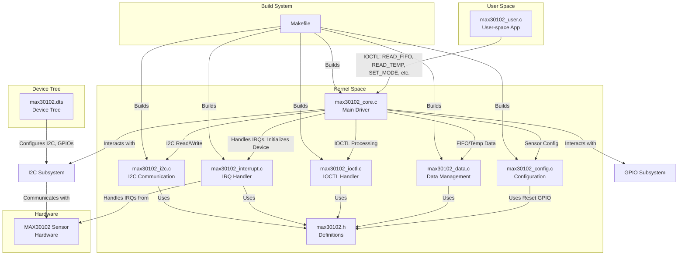

# MAX30102 Sensor Driver for Raspberry Pi (RUN for file max30102-kernel-module-advance)

This project provides a Linux kernel module for the MAX30102 heart rate and SpO2 sensor, along with a user-space application to interact with the sensor. The driver supports I2C communication, interrupt handling, FIFO management, and IOCTL operations for configuration and data retrieval.

## Table of Contents
- [Installation](#installation)
- [Device Tree Configuration](#device-tree-configuration)
- [Usage](#usage)
- [UML Diagram](#uml-diagram)
- [Architecture Flow](#architecture-flow)
- [Files](#files)

## Installation

To install the `max30102_driver` for the Raspberry Pi, follow these steps:

### Step 1: Navigate to the Project Directory
Clone or copy the project files to a directory on your Raspberry Pi (e.g., `/home/pi/max30102_driver`). Ensure all source files (`max30102_*.c`, `max30102.h`, `max30102.dts`, `max30102_user.c`, `Makefile`) are present.

```bash
cd /home/pi/max30102_driver
```

### Step 2: Convert Device Tree Blob to Source
Navigate to the `/boot` directory and convert the Raspberry Pi device tree blob (`.dtb`) file to a device tree source (`.dts`) file using the `dtc` command. Select the correct `.dtb` file for your Raspberry Pi model.

```bash
cd /boot
dtc -I dtb -O dts -o bcm2710-rpi-3-b.dts bcm2710-rpi-3-b.dtb
```

**Note**: Replace `bcm2710-rpi-3-b.dtb` with the appropriate `.dtb` file for your Raspberry Pi model (e.g., `bcm2711-rpi-4-b.dtb` for Raspberry Pi 4).

### Step 3: Modify the Device Tree
Open the `.dts` file created in Step 2 (e.g., `bcm2710-rpi-3-b.dts`) and locate the `i2c1` node. Add the MAX30102 device tree overlay by including the contents of `max30102.dts`:

```dts
/dts-v1/;
/plugin/;

/ {
    compatible = "brcm,bcm2711";

    fragment@0 {
        target = <&i2c1>;
        __overlay__ {
            status = "okay";

            max30102: max30102@57 {
                compatible = "maxim,max30102";
                reg = <0x57>;
                int-gpios = <&gpio 17 0>;
                reset-gpios = <&gpio 18 0>;
                led1-current-mA = <6>;
                led2-current-mA = <6>;
                interrupt-parent = <&gpio>;
                interrupts = <17 IRQ_TYPE_EDGE_FALLING>;
            };
        };
    };
};
```

Alternatively, you can apply the provided `max30102.dts` directly as an overlay (see [Device Tree Configuration](#device-tree-configuration)).

### Step 4: Recompile and Apply Device Tree
Recompile the modified `.dts` file back to `.dtb` and reboot the Raspberry Pi to apply the changes:

```bash
dtc -I dts -O dtb -o bcm2710-rpi-3-b.dtb bcm2710-rpi-3-b.dts
sudo reboot
```

**Note**: Replace `bcm2710-rpi-3-b.dtb` and `bcm2710-rpi-3-b.dts` with your model's files.

### Step 5: Build and Install the Driver
Return to the project directory and build the kernel module using the provided `Makefile`:

```bash
cd /home/pi/max30102_driver
make
```

This generates `max30102_driver.ko`. Install the driver into the system:

```bash
sudo insmod max30102_driver.ko
```

Verify the installation using:

```bash
dmesg | grep max30102
```

To remove the driver:

```bash
sudo rmmod max30102_driver
```

### Step 6: Build and Run the User Application
Compile the user-space application (`max30102_user.c`):

```bash
gcc max30102_user.c -o max30102_app -pthread
```

Run the application:

```bash
./max30102_app
```

To clean up generated files:

```bash
make clean
```

## Device Tree Configuration

The `max30102.dts` file defines the MAX30102 sensor on the I2C bus with interrupt and reset GPIOs. To apply the device tree overlay directly:

1. Compile the overlay:

```bash
dtc -@ -I dts -O dtb -o max30102.dtbo max30102.dts
```

2. Apply the overlay:

```bash
sudo dtoverlay max30102.dtbo
```

3. To remove the overlay:

```bash
sudo dtoverlay -r max30102
```

**Note**: Ensure the I2C interface is enabled on your Raspberry Pi (`sudo raspi-config`, select "Interfacing Options" -> "I2C" -> "Enable").

## Usage

The driver exposes a misc device (`/dev/max30102`) that can be controlled via IOCTLs. The `max30102_user.c` application demonstrates:
- Reading FIFO data (Red and IR samples) using `MAX30102_IOC_READ_FIFO`.
- Reading die temperature using `MAX30102_IOC_READ_TEMP`.
- Configuring the sensor mode, slots, FIFO, and SpO2 settings.

Example commands in `max30102_user.c`:
- Set SpO2 mode: `ioctl(fd, MAX30102_IOC_SET_MODE, &mode)` with `mode = 0x03`.
- Read FIFO data: `ioctl(fd, MAX30102_IOC_READ_FIFO, &fifo_data)`.
- Read temperature: `ioctl(fd, MAX30102_IOC_READ_TEMP, &temp)`.

The application uses threads to continuously read FIFO and temperature data, with `poll()` for efficient data availability checking.

## UML Diagram

Below is a UML class diagram representing the relationships between the main components of the MAX30102 driver and user application:

```plaintext
@startuml
package "Kernel Module" {
  [max30102_data] --> [max30102_core]
  [max30102_data] --> [max30102_ioctl]
  [max30102_data] --> [max30102_interrupt]
  [max30102_data] --> [max30102_config]
  [max30102_data] --> [max30102_i2c]
  [max30102_core] --> [max30102.h]
  [max30102_ioctl] --> [max30102.h]
  [max30102_interrupt] --> [max30102.h]
  [max30102_config] --> [max30102.h]
  [max30102_i2c] --> [max30102.h]
  [max30102_core] --> [I2C Subsystem]
  [max30102_core] --> [GPIO Subsystem]
  [max30102_core] --> [Misc Device]
}

package "Device Tree" {
  [max30102.dts] --> [I2C Subsystem]
}

package "User Space" {
  [max30102_user] --> [max30102.h]
  [max30102_user] --> [max30102_core] : IOCTL
}

[max30102.h] : Defines structs, IOCTLs, registers
[max30102_data] : FIFO and temperature reading
[max30102_ioctl] : IOCTL handling
[max30102_interrupt] : Interrupt handling
[max30102_config] : Sensor configuration
[max30102_i2c] : I2C communication
[max30102_core] : Main driver logic
[max30102_user] : User-space application
[max30102.dts] : Device tree overlay
@enduml
```

This diagram shows:
- The kernel module components (`max30102_*.c`) depend on `max30102.h` for shared definitions.
- `max30102_core` interacts with Linux subsystems (I2C, GPIO, Misc Device).
- `max30102_user` communicates with the kernel module via IOCTLs.
- `max30102.dts` configures the I2C device.

## Architecture Flow

The MAX30102 driver architecture is modular, with clear separation of concerns across the source files. Below is a Mermaid flowchart illustrating the data flow and interactions:



**Flow Description**:
1. **User Space** (`max30102_user.c`):
   - Opens `/dev/max30102` and uses IOCTLs to configure the sensor and read FIFO/temperature data.
   - Uses `poll()` to wait for data availability, with threads for continuous monitoring and a message queue for IPC.

2. **Kernel Space**:
   - `max30102_core.c`: Registers the misc device, sets up IRQs, and initializes the sensor via `max30102_config.c`.
   - `max30102_interrupt.c`: Processes FIFO full and other interrupts, storing data in buffers and signaling availability.
   - `max30102_data.c`: Reads FIFO data with auto-clear and temperature data with polling.
   - `max30102_ioctl.c`: Handles user-space IOCTLs for data retrieval and configuration.
   - `max30102_config.c`: Configures sensor settings (mode, slots, FIFO, SpO2) and performs hardware/software reset.
   - `max30102_i2c.c`: Manages low-level I2C communication with retries.

3. **Device Tree** (`max30102.dts`):
   - Configures the I2C address, interrupt GPIO, and reset GPIO for the MAX30102 sensor.

4. **Hardware**:
   - The MAX30102 sensor generates data, triggers interrupts, and communicates via I2C.

5. **Build System** (`Makefile`):
   - Compiles the kernel module by linking all `max30102_*.o` files into `max30102_driver.ko`.

**Data Flow**:
- The sensor generates data, triggering interrupts handled by `max30102_interrupt.c`.
- Data is stored in `max30102_data.c` buffers, with auto-clear after reading.
- User-space (`max30102_user.c`) polls for data and retrieves it via IOCTLs through `max30102_ioctl.c`.
- `max30102_config.c` and `max30102_i2c.c` handle sensor initialization and communication, respectively.

## Files
- `max30102.h`: Header file with register definitions, IOCTLs, and `max30102_data` structure.
- `max30102_core.c`: Main driver logic, including probe, remove, and file operations.
- `max30102_i2c.c`: I2C read/write functions.
- `max30102_interrupt.c`: Interrupt handling and workqueue processing.
- `max30102_config.c`: Sensor initialization and configuration.
- `max30102_data.c`: FIFO data and temperature reading with auto-clear.
- `max30102_ioctl.c`: IOCTL handling for user-space interaction.
- `max30102.dts`: Device tree overlay for I2C and GPIO configuration.
- `max30102_user.c`: User-space application for sensor interaction.
- `Makefile`: Build script for the kernel module.

This driver provides a robust interface for interacting with the MAX30102 sensor, suitable for heart rate and SpO2 monitoring applications on Raspberry Pi.
